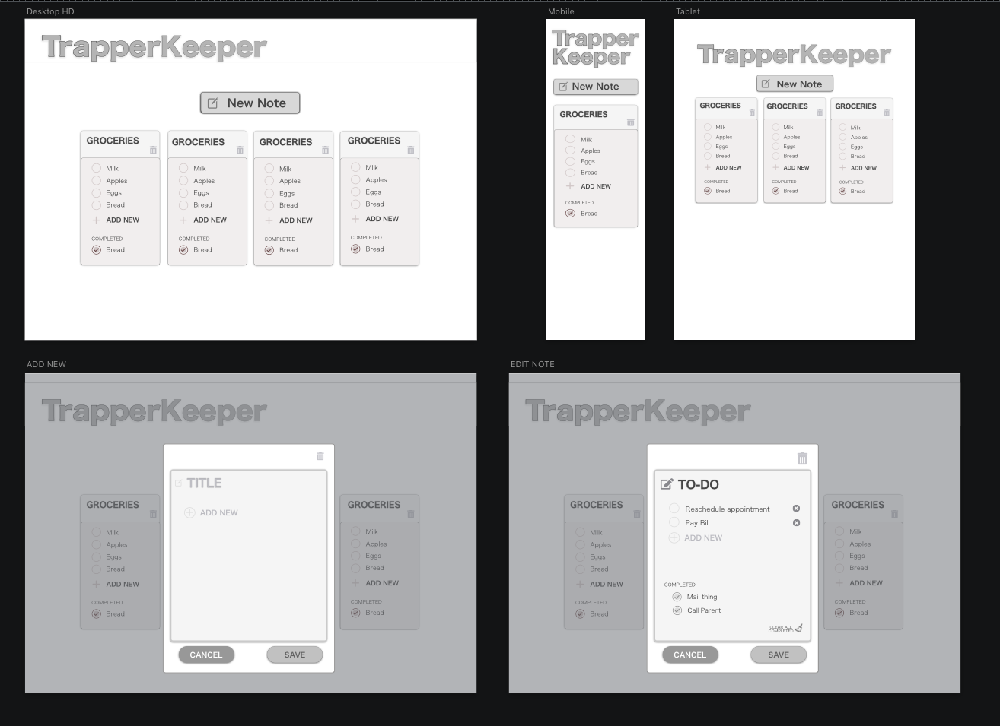
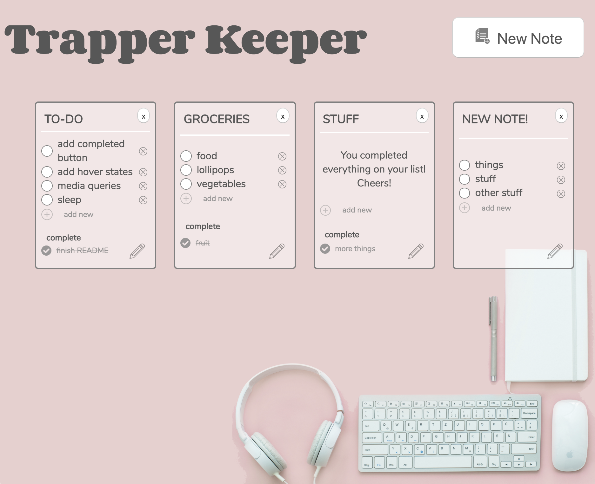

# Trapper Keeper
Assigned project for Module 3(of 4) of the Front-End Engineering program at Turing School of Software and Design in Denver, CO
+ Check out our back end repo at https://github.com/b3an5/trapper-keeper-fe

#### Contributors

+ Theo Bean https://github.com/b3an5
+ Kelly Zick https://github.com/misskelly
+ Mark Collins https://github.com/kobesparrow

## Intall/Setup

##### clone down backend
``` 
git clone https://github.com/misskelly/trapper-keeper-api 
npm install
npm start 
```


##### clone down frontend
```
git clone https://github.com/b3an5/trapper-keeper-fe`
npm install 
npm start
```
direct your browser to localhost:3000


## Stack
- React
- Redux
- Router
- SCSS
- Jest/Enzyme
- Git/GitHub

## Learning Goals
+ Continue to improve on building client-side applications using react, redux, and react router
+ Understand how to build a dynamic form ui
+ Understand how to build your own api using node and express
+ [Original assignment rubric](http://frontend.turing.io/projects/trapper-keeper.html)

## Wireframe


## Screenshots
Submitted project




****
[Group DTR (Define The Relationship) can be viewed here](https://gist.github.com/kobesparrow/f29d99498b748d1f2105260da9112153)
****
This project was bootstrapped with [Create React App](https://github.com/facebook/create-react-app).
